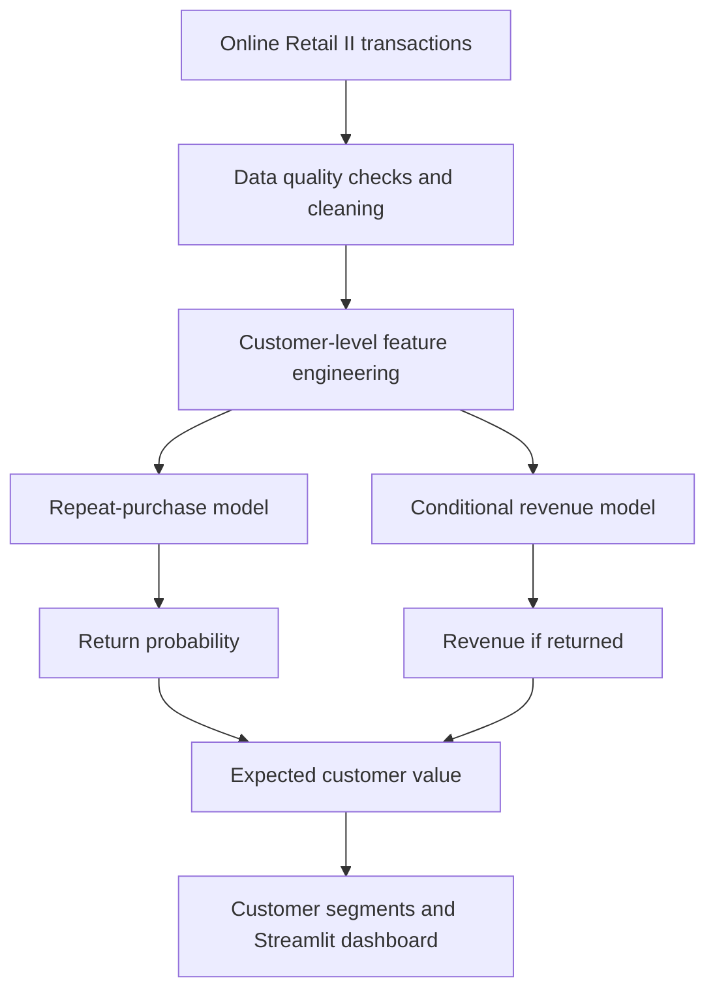

# Online Retail Customer Value Analytics

<div align="center">

[](https://www.python.org/)
[](https://jupyter.org/)
[](https://scikit-learn.org/)
[](https://customer-clv.streamlit.app/)
[](LICENSE)

**An interpretable statistical framework for identifying returning customers, estimating conditional future revenue, and supporting customer-retention decisions.**

[View Dashboard](https://customer-clv.streamlit.app/) · [Explore Notebooks](#-analysis-workflow) · [Review Results](#-key-results) · [Run Locally](#-run-the-project)

</div>

---

## Project overview

Online retailers can observe what customers purchased in the past, but historical transactions do not directly reveal who will return or how much future revenue each customer may generate. This project converts transaction history into two customer-level predictions:

1. **Repeat-purchase probability** using logistic regression.
2. **Conditional future revenue** using linear regression among returning customers.

The predictions are combined into an operational customer-value estimate:

$$
\widehat{V}_i
=
\widehat{P}(\text{return}_i)
\times
\widehat{E}(\text{future revenue}_i\mid\text{return}_i)
$$

> **Important interpretation:** This output is a fixed-horizon expected future-revenue proxy. It is not a complete profit-based lifetime value because the dataset does not contain contribution margins, campaign costs or acquisition costs.

---

## Business questions

- Which customers are most likely to purchase again?
- How much future revenue could returning customers generate?
- Which customers should receive greater attention in retention planning?
- Do customer location, spending history and purchasing behaviour provide useful evidence for business decisions?
- How can the results be communicated to non-technical decision-makers?

---

## Solution workflow



<details>
<summary><strong>How the two models work together</strong></summary>

The classification model estimates the probability that a customer returns. The revenue model estimates future revenue conditional on that customer returning. Multiplying the two values discounts conditional revenue by the probability of return.

For example, if a customer has a return probability of `0.70` and predicted conditional revenue of `£1,000`, the expected customer value is:

```text
Expected customer value = 0.70 × £1,000 = £700
```

This value supports customer prioritisation. It should not be interpreted as the causal return from offering a discount or contacting the customer.

</details>

---

## Dataset

The project uses the [UCI Online Retail II dataset](https://archive.ics.uci.edu/dataset/502/online+retail+ii), containing transactions from a UK-based online non-store retailer.

| Item | Original data |
|---|---:|
| Transaction lines | 1.07 million |
| Invoices | 53,628 |
| Identifiable customers | 5,942 |
| Countries | 43 |
| Period | December 2009 to December 2011 |

The final customer-level modelling dataset contains **4,266 customers** and **30 variables** after preprocessing and feature engineering.

<details>
<summary><strong>Key data-quality considerations</strong></summary>

- Missing customer identifiers cannot support customer-level modelling.
- Invoice numbers beginning with `C` indicate cancellations.
- Negative quantities and return transactions require explicit treatment.
- Large wholesale purchases can create influential observations.
- Transaction lines must be aggregated into invoices and customer histories.
- All predictors must be calculated before the future outcome period to prevent leakage.

</details>

---

## Analysis workflow

Run the notebooks in numerical order.

| Notebook | Purpose | Open in Colab |
|---|---|---|
| [`01_data_audit_and_cleaning.ipynb`](notebooks/01_data_audit_and_cleaning.ipynb) | Audit, clean and separate purchases and returns | [Open](https://colab.research.google.com/github/YOUR_USERNAME/online-retail-customer-value-analytics/blob/main/notebooks/01_data_audit_and_cleaning.ipynb) |
| [`02_descriptive_analysis.ipynb`](notebooks/02_descriptive_analysis.ipynb) | Explore customer behaviour and initial business patterns | [Open](https://colab.research.google.com/github/YOUR_USERNAME/online-retail-customer-value-analytics/blob/main/notebooks/02_descriptive_analysis.ipynb) |
| [`03_statistical_inference.ipynb`](notebooks/03_statistical_inference.ipynb) | Conduct Levene, Welch and proportion tests | [Open](https://colab.research.google.com/github/YOUR_USERNAME/online-retail-customer-value-analytics/blob/main/notebooks/03_statistical_inference.ipynb) |
| [`04_predictive_modelling.ipynb`](notebooks/04_predictive_modelling.ipynb) | Build and evaluate the final two-stage model | [Open](https://colab.research.google.com/github/YOUR_USERNAME/online-retail-customer-value-analytics/blob/main/notebooks/04_predictive_modelling.ipynb) |
| [`05_experimental_design.ipynb`](notebooks/05_experimental_design.ipynb) | Evaluate CRD and RCBD for a future retention experiment | [Open](https://colab.research.google.com/github/YOUR_USERNAME/online-retail-customer-value-analytics/blob/main/notebooks/05_experimental_design.ipynb) |
| [`06_pca_evaluation.ipynb`](notebooks/06_pca_evaluation.ipynb) | Evaluate whether dimensionality reduction is appropriate | [Open](https://colab.research.google.com/github/YOUR_USERNAME/online-retail-customer-value-analytics/blob/main/notebooks/06_pca_evaluation.ipynb) |
| [`07_bayesian_analysis.ipynb`](notebooks/07_bayesian_analysis.ipynb) | Evaluate Naive Bayes and Bayesian Ridge alternatives | [Open](https://colab.research.google.com/github/YOUR_USERNAME/online-retail-customer-value-analytics/blob/main/notebooks/07_bayesian_analysis.ipynb) |
| [`08_time_series_analysis.ipynb`](notebooks/08_time_series_analysis.ipynb) | Analyse monthly revenue and seasonal forecasts | [Open](https://colab.research.google.com/github/YOUR_USERNAME/online-retail-customer-value-analytics/blob/main/notebooks/08_time_series_analysis.ipynb) |

> Replace `YOUR_USERNAME` in the Colab links after creating the GitHub repository.

---

## Features used in the final models

<details open>
<summary><strong>Repeat-purchase model</strong></summary>

| Feature | Business meaning |
|---|---|
| `RecencyDays` | Days since the customer's most recent historical purchase |
| `LogFrequency` | Log-transformed historical purchase frequency |
| `LogMonetaryValue` | Log-transformed historical customer spending |
| `LogAverageOrderValue` | Log-transformed average invoice value |
| `LogTotalQuantity` | Log-transformed quantity purchased |
| `LogProductDiversity` | Log-transformed number of distinct products |
| `IsUK` | Whether the customer's primary country is the United Kingdom |

</details>

<details>
<summary><strong>Conditional revenue model</strong></summary>

The revenue model uses historical behavioural variables available before the future outcome period. It is trained on returning customers because its purpose is to estimate revenue conditional on a future purchase occurring.

Future purchase counts, future revenue and other outcome-period information are excluded from predictors to prevent data leakage.

</details>

---

## Key results

### Repeat-purchase prediction

| Metric | Logistic regression |
|---|---:|
| Accuracy | **73.65%** |
| Precision | **76.35%** |
| Recall | **85.16%** |
| Specificity | **53.25%** |
| F1-score | **80.52%** |
| ROC-AUC | **0.7897** |
| PR-AUC | **0.8677** |

The model identified approximately **85 out of every 100 customers who returned**. Its moderate specificity means that identifying customers who do not return remains more difficult.

### Alternative classification model

| Metric | Naive Bayes | Logistic regression |
|---|---:|---:|
| Accuracy | 71.43% | **73.65%** |
| Precision | **80.32%** | 76.35% |
| Recall | 73.26% | **85.16%** |
| ROC-AUC | 0.7821 | **0.7897** |

Logistic regression was retained because it achieved better overall performance and identified substantially more returning customers.

<details>
<summary><strong>Main model interpretation</strong></summary>

- Greater historical purchase frequency was associated with higher repeat-purchase odds.
- Greater historical monetary value and quantity also increased predicted return likelihood.
- Longer recency, meaning more time since the last purchase, reduced repeat-purchase likelihood.
- Customer location provided little additional predictive value after controlling for behaviour.
- These relationships are predictive associations and should not be interpreted as causal effects.

</details>

---

## Statistical evidence

| Question | Method | Result | Business implication |
|---|---|---|---|
| Do retention groups have equal spending variability? | Levene's test | $W=32.27$, $p<0.001$ | Variability differs, supporting a variance-robust mean comparison |
| Does historical value differ between retention groups? | Welch's t-test | $t=29.95$, $p<0.001$ | Returning customers had higher historical value |
| Do UK and non-UK customers have different repeat rates? | Two-proportion z-test | $z=-1.38$, $p=0.1684$ | Location alone does not provide sufficient evidence for different retention targeting |

---

## Dashboard

The Streamlit dashboard translates model outputs into plain business language for non-technical users.

### Dashboard capabilities

- Search for an individual customer.
- Review return likelihood and conditional future revenue.
- View expected customer value and value segment.
- Filter customers by segment and return likelihood.
- Explore customer-level drivers and portfolio distributions.
- Download customer lists for further campaign planning.

### Live application

**[Launch the Customer Value Dashboard](https://customer-clv.streamlit.app/)**

<!-- Optional: add a screenshot at docs/images/dashboard-overview.png and uncomment the line below. -->
<!--  -->

---

## Repository structure

```text
online-retail-customer-value-analytics/
├── README.md
├── requirements.txt
├── LICENSE
├── .gitignore
├── notebooks/
│   ├── 01_data_audit_and_cleaning.ipynb
│   ├── 02_descriptive_analysis.ipynb
│   ├── 03_statistical_inference.ipynb
│   ├── 04_predictive_modelling.ipynb
│   ├── 05_experimental_design.ipynb
│   ├── 06_pca_evaluation.ipynb
│   ├── 07_bayesian_analysis.ipynb
│   └── 08_time_series_analysis.ipynb
├── data/
│   ├── README.md
│   ├── cleaned/
│   └── processed/
├── dashboard/
│   ├── app.py
│   └── requirements.txt
├── outputs/
│   ├── figures/
│   └── tables/
├── reports/
└── docs/
```

---

## Run the project

### 1. Clone the repository

```bash
git clone https://github.com/YOUR_USERNAME/online-retail-customer-value-analytics.git
cd online-retail-customer-value-analytics
```

### 2. Create a virtual environment

```bash
python -m venv .venv
```

Activate it on Windows:

```powershell
.venv\Scripts\activate
```

Activate it on macOS or Linux:

```bash
source .venv/bin/activate
```

### 3. Install dependencies

```bash
pip install -r requirements.txt
```

### 4. Start Jupyter

```bash
jupyter notebook
```

### 5. Run the dashboard

```bash
streamlit run dashboard/app.py
```

<details>
<summary><strong>Running in Google Colab</strong></summary>

1. Open a notebook using its Colab link.
2. Mount Google Drive only if the data are stored there.
3. Update data paths or clone the repository into the Colab session.
4. Run notebooks in numerical order when generated outputs are required by later stages.

For a portable repository, prefer relative paths such as:

```python
from pathlib import Path

PROJECT_ROOT = Path.cwd().parent
DATA_PATH = PROJECT_ROOT / "data" / "processed" / "customer_clv_model.csv"
```

</details>

---

## Reproducibility

- Random operations use `random_state=42` where supported.
- Classification uses a stratified train-test split.
- Cross-validation evaluates model stability across multiple data partitions.
- Predictors use historical-period information only.
- Future outcome variables are excluded from model inputs.
- Model assumptions and limitations are reported alongside performance.

---

## Limitations

- The data represent one historical UK retailer from 2009 to 2011.
- Revenue is not equivalent to contribution margin or profit.
- Customer inactivity does not prove permanent churn in non-contractual retail.
- Returns, cancellations and wholesale purchases can affect value estimates.
- Model outputs support prioritisation but do not measure the causal effect of retention offers.
- Performance should be monitored before using the model in another retailer or time period.

---

## Ethical and responsible use

- Use behavioural variables for prioritisation and avoid sensitive personal attributes.
- Do not use customer location as the sole basis for retention decisions.
- Explain predictions in language that business users can understand.
- Monitor for performance differences across customer groups.
- Evaluate retention interventions through a controlled experiment before claiming causal impact.

---

## Research and project documentation

- [`docs/methodology.md`](docs/methodology.md): target definitions, feature engineering and evaluation design
- [`docs/data_dictionary.md`](docs/data_dictionary.md): variable definitions and units
- [`docs/model_limitations.md`](docs/model_limitations.md): assumptions, risks and deployment constraints
- [`reports/research_landscape.pdf`](reports/research_landscape.pdf): peer-reviewed research review
- [`reports/consultancy_presentation.pdf`](reports/consultancy_presentation.pdf): final consultancy presentation

---

## Citation

If you use this repository, cite the project as:

```bibtex
@misc{online_retail_customer_value_2026,
  title  = {Online Retail Customer Value Analytics},
  author = {2026-DS-27},
  year   = {2026},
  url    = {https://github.com/DularaMadhusanka/online-retail-customer-value-analytics}
}
```

The original dataset should be cited separately:

> UCI Machine Learning Repository. (2019). *Online Retail II* [Dataset]. https://archive.ics.uci.edu/dataset/502/online+retail+ii

---

## License

This project is available under the [MIT License](LICENSE). The Online Retail II dataset remains subject to the terms provided by the UCI Machine Learning Repository.

---

<div align="center">

**From historical transactions to practical customer-retention decisions**

[Back to top](#online-retail-customer-value-analytics)

</div>
